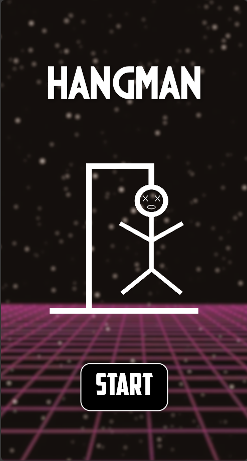
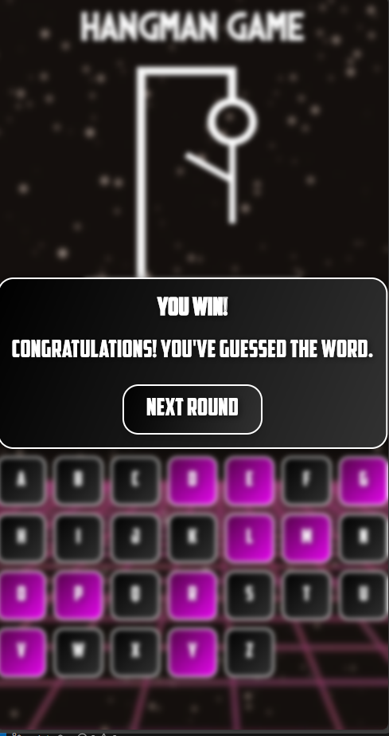
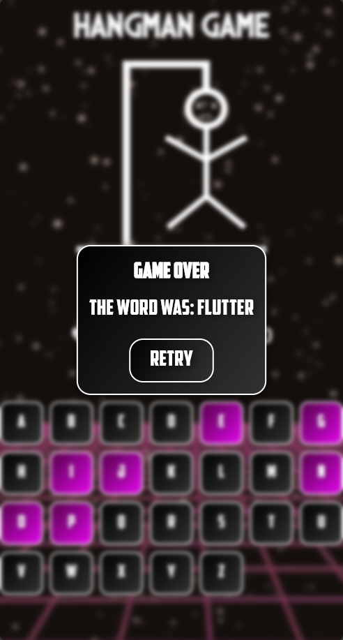

# 🎮 Hangman Flutter Game 🕹️

Welcome to **Hangman**, a beautifully crafted retro-style word guessing game built with Flutter! ✨



---

## 🚀 Overview

Test your vocabulary and have fun with this classic game, now with a modern, visually engaging UI and smooth animations. Guess the hidden word, one letter at a time, before the hangman is complete!

---

## 🏆 Features

- 🎨 Retro-inspired, vibrant UI
- 📱 Cross-platform: Android, iOS, Windows, macOS, Linux, and Web
- 🔤 Dynamic word selection from a curated list
- 💡 Animated transitions and feedback
- 🔄 Streak tracking for consecutive wins
- ❤️ Lives system and end-game dialogs
- 📸 Beautiful background and custom fonts

---

## 🖥️ Screenshots

| Start Page | In-Game | Win Dialog | Lose Dialog |
|:----------:|:-------:|:----------:|:-----------:|
|  |  |  |  |

---

## ⚙️ Getting Started

1. **Clone the repo:**
   ```bash
   git clone <your-repo-url>
   cd Hangman
   ```
2. **Install dependencies:**
   ```bash
   flutter pub get
   ```
3. **Run the app:**
   ```bash
   flutter run
   ```

---

## 📂 Project Structure

- `lib/` — Main source code
  - `main.dart` — App entry point
  - `start_page.dart` — Start screen UI
  - `game_page.dart` — Main game UI and logic
  - `game_logic.dart` — Core game mechanics
  - `word_list.dart` — Word bank
- `assets/` — Images and fonts
- `screenshots/` — App screenshots

---

## 🙌 Credits

Developed with ❤️ using Flutter. Enjoy playing and feel free to contribute or suggest features!

---

## 📄 License

This project is open source and available under the [MIT License](LICENSE).
